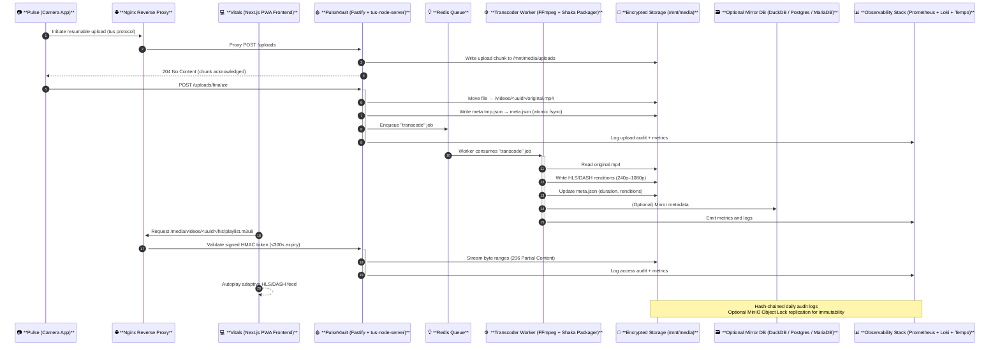

# PulseVault


**Pulse** is a family of open, self-hosted tools for capturing, processing, and sharing secure video and data in healthcare and research environments.

This repository defines the **Pulse Platform** architecture and coordination between its components:

| Component | Description | Stack |
|------------|--------------|-------|
| **Pulse** | Capture app for recording and uploading encrypted video/data | Native / Mobile |
| **PulseVault** | Backend storage and processing system (Fastify + FFmpeg + Redis + Nginx) | Node.js |
| **Vitals** | Frontend application for viewing and interacting with short-form, streaming media | React + Next.js (PWA) |

---

## Overview

**PulseVault** receives encrypted uploads from the **Pulse** camera app, transcodes them to adaptive HLS/DASH video, and serves them securely to **Vitals** clients.  
The entire system is designed for **HIPAA compliance**, **self-hosted deployment**, and **high performance** across web and mobile.

---

## Architecture

```

+---------------------------+
|       Pulse (App)         |
|  Record & push content    |
+-------------+-------------+
|
| HTTPS (tus resumable uploads)
v
+---------------------------+
|     PulseVault Backend    |
|  Fastify + FFmpeg + Redis |
|  HMAC-signed media access |
+-------------+-------------+
|
| HLS/DASH streams via Nginx
v
+---------------------------+
|        Vitals Frontend    |
|  Next.js PWA / Expo app   |
|  Infinite video feed      |
+---------------------------+

```

### Core Principles
- **Disk-first metadata**: every video has a `meta.json` sidecar (source of truth).  
- **No PHI in URLs or logs.**
- **Encryption everywhere**: TLS + LUKS/ZFS at rest.
- **Resumable uploads**: `tus-node-server` for reliable large-file transfers.
- **Adaptive playback**: FFmpeg + Shaka Packager (240p–1080p; optional HEVC/AV1).
- **Observability**: Prometheus, Grafana, Loki, Tempo (self-hosted only).
- **Optional BAA extensions**: MinIO Object Lock, CDN edge nodes, secure mail/SMS integrations.

---

## 📦 Repositories

- [`pulsevault`](https://github.com/mieweb/pulsevault) 
  * pulsevault/  - Secure backend for ingest, transcoding, and serving HLS/DASH media.
  * vitals/ -  Next.js PWA for viewing Pulse content in an infinite short-video feed.

- [`pulse`](https://github.com/mieweb/pulse) -  Camera and sensor capture app. Records encrypted video/data and pushes to PulseVault.

---

##  Stack Details




### PulseVault (Backend)
- **Server:** Fastify + TypeScript
- **Uploads:** tus-node-server
- **Media Pipeline:** FFmpeg + Shaka Packager
- **Queue:** Redis (expandable to Redpanda/Kafka/RabbitMQ)
- **Search:** Postgres pgvector (default) or OpenSearch (optional)
- **Observability:** Prometheus, Grafana, Loki, Tempo
- **Reverse Proxy:** Nginx (TLS, rate-limit, caching)
- **Immutable Logs:** optional MinIO Object Lock bucket

### Vitals (Frontend)
- **Framework:** Next.js (App Router) + React + TypeScript
- **Styling:** TailwindCSS + Framer Motion
- **Upload:** Uppy + tus client
- **Feed:** react-virtuoso infinite scroll
- **Video:** HTML5 video + hls.js (desktop) / native HLS (iOS)
- **Auth:** JWT/OIDC (Clerk/Auth.js)
- **PWA:** installable, offline shell, cached segments
- **Realtime:** WebSocket (fastify-ws)
- **Optional native:** Expo wrapper using react-native-web

---

## 🔒 Compliance & Security

| Requirement | Implementation |
|--------------|----------------|
| **Encryption in transit** | TLS 1.2+ across all services |
| **Encryption at rest** | LUKS/ZFS encrypted volumes |
| **Access control** | JWT auth, signed HMAC URLs (≤300 s expiry) |
| **Audit logs** | Append-only, hash-chained daily rotation |
| **Data minimization** | UUID-only identifiers, no PHI in filenames |
| **BAA extensions** | optional CDN, MinIO, and alerting integrations |

---

## 🧪 Development Setup

PulseVault will expose API endpoints on `https://localhost:3000`
Vitals will serve the web/PWA interface on `https://localhost:4000`.

---

## 🧰 Infrastructure & Monitoring

| Component      | Purpose                       |
| -------------- | ----------------------------- |
| **Redis**      | job queue, rate limiting      |
| **Prometheus** | metrics collection            |
| **Grafana**    | dashboards                    |
| **Loki**       | log aggregation               |
| **Tempo**      | distributed tracing           |
| **Nginx**      | proxy + TLS + static delivery |

Deploy all services with Docker Compose or Helm using `infra/` manifests.

---

## 🚀 Deployment Targets

* **Self-hosted Kubernetes** (recommended)
* **Bare-metal Docker Compose**
* **Air-gapped lab environments**
* Optional external CDN (BAA required)

---

## 🧭 Future Modules

* **PulseAI** — AI-assisted tagging and retrieval via local LLM or vector DB
* **PulseMonitor** — Live system health dashboards
* **PulseSync** — Edge replication and backup verification

---

## 📄 License

All components of the Pulse Platform are released under a source-available license.
Usage for HIPAA-covered or regulated workloads requires a signed BAA and on-premise deployment.

---

### 🫀 “Your data has a heartbeat.”

**PulseVault** protects it.
**Vitals** makes it visible.
**Pulse** brings it to life.
