# PulseVault


**Pulse** is a family of open, self-hosted tools for capturing, processing, and sharing secure video and data in healthcare and research environments.

This repository defines the **Pulse Platform** architecture and coordination between its components:

| Component | Description | Stack |
|------------|--------------|-------|
| **Pulse** | Capture app for recording and uploading encrypted video/data | Native / Mobile |
| **PulseVault** | Backend storage and processing system (Fastify + FFmpeg + Redis + Nginx) | Node.js |
| **Vitals** | Frontend application for viewing and interacting with short-form, streaming media | React + Next.js (PWA) |

---

## Overview

**PulseVault** receives encrypted uploads from the **Pulse** camera app, transcodes them to adaptive HLS/DASH video, and serves them securely to **Vitals** clients.  
The entire system is designed for **HIPAA compliance**, **self-hosted deployment**, and **high performance** across web and mobile.

---

## Architecture

```
+---------------------------+
|       Pulse (App)         |
|  Record & push content    |
+-------------+-------------+
|
| HTTPS (tus resumable uploads)
v
+---------------------------+
|     PulseVault Backend    |
|  Fastify + FFmpeg + Redis |
|  HMAC-signed media access |
+-------------+-------------+
|
| HLS/DASH streams via Nginx
v
+---------------------------+
|        Vitals Frontend    |
|  Next.js PWA / Expo app   |
|  Infinite video feed      |
+---------------------------+

```

For detailed architecture documentation, see [SYSTEM_ARCHITECTURE.md](SYSTEM_ARCHITECTURE.md).

### Core Principles
- **Disk-first metadata**: every video has a `meta.json` sidecar (source of truth).  
- **No PHI in URLs or logs.**
- **Encryption everywhere**: TLS + LUKS/ZFS at rest.
- **Resumable uploads**: `tus-node-server` for reliable large-file transfers.
- **Adaptive playback**: FFmpeg + Shaka Packager (240p–1080p; optional HEVC/AV1).
- **Observability**: Prometheus, Grafana, Loki, Tempo (self-hosted only).
- **Optional BAA extensions**: MinIO Object Lock, CDN edge nodes, secure mail/SMS integrations.

---

## 📦 Repositories

- **[`pulsevault`](https://github.com/mieweb/pulsevault)** (This repository)
  * `pulsevault/` - Secure backend for ingest, transcoding, and serving HLS/DASH media.
  * `vitals/` - Next.js PWA for viewing Pulse content in an infinite short-video feed.

- **[`pulse`](https://github.com/mieweb/pulse)** - Mobile camera and sensor capture app
  * React Native/Expo cross-platform mobile application
  * Records encrypted video/data and pushes to PulseVault via tus protocol
  * Features: Video recording, editing, draft management, cross-platform support
  * Designed for secure institutional knowledge sharing through short-form video content
  * Documentation: [https://github.com/mieweb/pulse](https://github.com/mieweb/pulse)

---

##  Stack Details

```mermaid
sequenceDiagram
    autonumber

    participant Pulse as 📷 **Pulse (Camera App)**
    participant Nginx as 🌐 **Nginx Reverse Proxy**
    participant Vitals as 💻 **Vitals (Next.js PWA Frontend)**
    participant PulseVault as 🩸 **PulseVault (Fastify + tus-node-server)**
    participant Redis as 💡 **Redis Queue**
    participant Transcoder as ⚙️ **Transcoder Worker (FFmpeg + Shaka Packager)**
    participant Storage as 💾 **Encrypted Storage (/mnt/media)**
    participant Database as 🗃️ **Optional Mirror DB (DuckDB / Postgres / MariaDB)**
    participant Observability as 📊 **Observability Stack (Prometheus + Loki + Tempo)**

    %% --- Upload Phase ---
    Pulse->>+Nginx: Initiate resumable upload (tus protocol)
    Nginx->>+PulseVault: Proxy POST /uploads
    PulseVault->>Storage: Write upload chunk to /mnt/media/uploads
    PulseVault-->>Pulse: 204 No Content (chunk acknowledged)
    Pulse->>+PulseVault: POST /uploads/finalize
    PulseVault->>Storage: Move file → /videos/<uuid>/original.mp4
    PulseVault->>Storage: Write meta.tmp.json → meta.json (atomic fsync)
    PulseVault->>Redis: Enqueue "transcode" job
    PulseVault->>Observability: Log upload audit + metrics
    deactivate PulseVault

    %% --- Transcode Phase ---
    Redis->>+Transcoder: Worker consumes "transcode" job
    Transcoder->>Storage: Read original.mp4
    Transcoder->>Storage: Write HLS/DASH renditions (240p–1080p)
    Transcoder->>Storage: Update meta.json (duration, renditions)
    Transcoder->>Database: (Optional) Mirror metadata
    Transcoder->>Observability: Emit metrics and logs
    deactivate Transcoder

    %% --- Playback Phase ---
    Vitals->>+Nginx: Request /media/videos/<uuid>/hls/playlist.m3u8
    Nginx->>+PulseVault: Validate signed HMAC token (≤300s expiry)
    PulseVault->>Storage: Stream byte ranges (206 Partial Content)
    PulseVault->>Observability: Log access audit + metrics
    deactivate PulseVault
    Vitals-->>Vitals: Autoplay adaptive HLS/DASH feed

    %% --- Observability & Retention ---
    Note over Observability,Storage: Hash-chained daily audit logs<br/>Optional MinIO Object Lock replication for immutability
```




### PulseVault (Backend)
- **Server:** Fastify + TypeScript
- **Uploads:** tus-node-server
- **Media Pipeline:** FFmpeg + Shaka Packager
- **Queue:** Redis (expandable to Redpanda/Kafka/RabbitMQ)
- **Search:** Postgres pgvector (default) or OpenSearch (optional)
- **Observability:** Prometheus, Grafana, Loki, Tempo
- **Reverse Proxy:** Nginx (TLS, rate-limit, caching)
- **Immutable Logs:** optional MinIO Object Lock bucket

### Vitals (Frontend)
- **Framework:** Next.js (App Router) + React + TypeScript
- **Styling:** TailwindCSS + Framer Motion
- **Upload:** Uppy + tus client
- **Feed:** react-virtuoso infinite scroll
- **Video:** HTML5 video + hls.js (desktop) / native HLS (iOS)
- **Auth:** JWT/OIDC (Clerk/Auth.js)
- **PWA:** installable, offline shell, cached segments
- **Realtime:** WebSocket (fastify-ws)
- **Optional native:** Expo wrapper using react-native-web

---

## 🔒 Compliance & Security

| Requirement | Implementation |
|--------------|----------------|
| **Encryption in transit** | TLS 1.2+ across all services |
| **Encryption at rest** | LUKS/ZFS encrypted volumes |
| **Access control** | JWT auth, signed HMAC URLs (≤300 s expiry) |
| **Audit logs** | Append-only, hash-chained daily rotation |
| **Data minimization** | UUID-only identifiers, no PHI in filenames |
| **BAA extensions** | optional CDN, MinIO, and alerting integrations |

---

## 🧪 Development Setup

```bash
./scripts/setup.sh              # Automated setup (includes SSL certs)
cd pulsevault && npm run dev        # Terminal 1: API server
cd pulsevault && npm run worker     # Terminal 2: Worker
```

API: `http://localhost:3000` | Full setup: [SETUP.md](SETUP.md)

---

## 🧰 Infrastructure & Monitoring

| Component      | Purpose                       |
| -------------- | ----------------------------- |
| **Redis**      | job queue, rate limiting      |
| **Prometheus** | metrics collection            |
| **Grafana**    | dashboards                    |
| **Loki**       | log aggregation               |
| **Tempo**      | distributed tracing           |
| **Nginx**      | proxy + TLS + static delivery |

Deploy all services with Docker Compose. See [SYSTEM_ARCHITECTURE.md](SYSTEM_ARCHITECTURE.md) for full infrastructure details.

---

## 🚀 Deployment Targets

* **Self-hosted Kubernetes** (recommended)
* **Bare-metal Docker Compose**
* **Air-gapped lab environments**
* Optional external CDN (BAA required)

For production deployment, see [SETUP.md](SETUP.md#-production-setup).

---

## 📚 Documentation

- **[SETUP.md](SETUP.md)** - Complete setup guide (development & production) + API reference
- **[SYSTEM_ARCHITECTURE.md](SYSTEM_ARCHITECTURE.md)** - System architecture, features, tests, troubleshooting

---

## ✅ System Status

**Status:** ✅ Fully Operational | **Tests:** 27/27 passing (100%)

**Services:** All 8 services running and healthy (Backend, Redis, Nginx, Worker, Prometheus, Grafana, Loki, Promtail)

**Features:** Upload, Transcoding, Media Delivery, Audit Logging, Metrics, Log Aggregation

**Data Persistence:** 6 volumes configured (media, redis, prometheus, grafana, loki, nginx-cache)

---

## 🧭 Future Modules

* **PulseAI** — AI-assisted tagging and retrieval via local LLM or vector DB
* **PulseMonitor** — Live system health dashboards
* **PulseSync** — Edge replication and backup verification

---

## 📄 License

All components of the Pulse Platform are released under a source-available license.
Usage for HIPAA-covered or regulated workloads requires a signed BAA and on-premise deployment.

---

### 🫀 "Your data has a heartbeat."

**PulseVault** protects it.
**Vitals** makes it visible.
**Pulse** brings it to life.
