# PulseVault


**Pulse** is a family of open, self-hosted tools for capturing, processing, and sharing secure video and data in healthcare and research environments.

This repository defines the **Pulse Platform** architecture and coordination between its components:

| Component | Description | Stack |
|------------|--------------|-------|
| **Pulse** | Capture app for recording and uploading encrypted video/data | Native / Mobile |
| **PulseVault Backend** | Storage and processing system (Fastify + FFmpeg + Redis + Nginx) | Node.js |
| **PulseVault Frontend** | Frontend application for uploading, viewing, and managing short-form videos | Next.js + React + TypeScript |

---

## Overview

**PulseVault** is a HIPAA-compliant video storage and delivery platform. The **Backend** receives encrypted uploads from the **Pulse** camera app, transcodes them to adaptive HLS/DASH video, and serves them securely. **PulseVault Frontend** provides a web interface for users to upload short-form videos, view them in an infinite feed, manage their profiles, and access administrative features.

The entire system is designed for **HIPAA compliance**, **self-hosted deployment**, and **high performance** across web and mobile.

---

## Architecture

```
┌─────────────────────────────┐
│       Pulse (App)           │
│  Record & push content      │
└──────────────┬──────────────┘
               │
               │ HTTPS (tus resumable uploads)
               ▼
┌─────────────────────────────┐
│   PulseVault Backend        │
│  Fastify + FFmpeg + Redis   │
│  HMAC-signed media access   │
└──────────────┬──────────────┘
               │
               │ HLS/DASH streams via Nginx
               ▼
┌─────────────────────────────┐
│   PulseVault Frontend        │
│  Next.js App                 │
│  - Video upload              │
│  - Short-form video feed     │
│  - User management          │
│  - Admin dashboard           │
└─────────────────────────────┘
```

For detailed architecture documentation, see [SYSTEM_ARCHITECTURE.md](SYSTEM_ARCHITECTURE.md).

### Authentication Architecture

```
┌─────────────────────────────────────────────────────────────────┐
│                    Authentication Flow                            │
└─────────────────────────────────────────────────────────────────┘

┌──────────────┐
│   User       │
│  (Browser)   │
└──────┬───────┘
       │
       │ 1. Click "Sign in with Google/GitHub"
       ▼
┌─────────────────────────────────────────────────────────────┐
│         PulseVault Frontend (Next.js)                       │
│  ┌──────────────────────────────────────────────────────┐  │
│  │  Auth Page (/auth)                                    │  │
│  │  - SSO-only authentication                            │  │
│  │  - Google OAuth button                                │  │
│  │  - GitHub OAuth button                                │  │
│  └──────────────────────────────────────────────────────┘  │
│                                                              │
│  ┌──────────────────────────────────────────────────────┐  │
│  │  Better Auth (auth.ts)                               │  │
│  │  - Social providers (Google, GitHub)                  │  │
│  │  - Account linking                                    │  │
│  │  - Session management                                 │  │
│  └──────────────────────────────────────────────────────┘  │
└──────┬───────────────────────────────────────────────────────┘
       │
       │ 2. Redirect to OAuth provider
       ▼
┌─────────────────────────────────────────────────────────────┐
│         OAuth Provider (Google / GitHub)                    │
│  - User authenticates                                       │
│  - Grants permissions                                       │
│  - Returns authorization code                               │
└──────┬───────────────────────────────────────────────────────┘
       │
       │ 3. OAuth callback with code
       ▼
┌─────────────────────────────────────────────────────────────┐
│         Better Auth API (/api/[...all]/route.ts)            │
│  - Exchanges code for tokens                                │
│  - Fetches user profile (name, email, avatar)               │
│  - Creates/updates user in database                         │
│  - Generates session cookie                                 │
│                                                              │
│  ┌──────────────────────────────────────────────────────┐  │
│  │  Arcjet Security                                     │  │
│  │  - Bot detection                                      │  │
│  │  - Rate limiting (10 req/10min for auth)              │  │
│  │  - Shield protection                                  │  │
│  └──────────────────────────────────────────────────────┘  │
└──────┬───────────────────────────────────────────────────────┘
       │
       │ 4. Session cookie set, redirect to dashboard
       ▼
┌─────────────────────────────────────────────────────────────┐
│         PulseVault Frontend                                  │
│  ┌──────────────────────────────────────────────────────┐  │
│  │  Dashboard (/dashboard)                              │  │
│  │  - Authenticated user session                         │  │
│  │  - Video viewing interface                             │  │
│  │  - Video upload functionality                         │  │
│  └──────────────────────────────────────────────────────┘  │
│                                                              │
│  ┌──────────────────────────────────────────────────────┐  │
│  │  Profile Page (/profile)                             │  │
│  │  - View profile (name, email, avatar from OAuth)     │  │
│  │  - Edit name only                                     │  │
│  │  - Manage linked accounts                             │  │
│  │  - Delete account                                     │  │
│  └──────────────────────────────────────────────────────┘  │
│                                                              │
│  ┌──────────────────────────────────────────────────────┐  │
│  │  Admin Page (/admin) - Admin users only              │  │
│  │  - User management                                    │  │
│  │  - Role management                                    │  │
│  └──────────────────────────────────────────────────────┘  │
└─────────────────────────────────────────────────────────────┘

┌─────────────────────────────────────────────────────────────┐
│         Database (PostgreSQL)                               │
│  - User accounts                                             │
│  - OAuth account links                                       │
│  - Sessions                                                  │
│  - Roles and permissions                                     │
└─────────────────────────────────────────────────────────────┘
```

**Key Authentication Features:**
- **SSO-only**: No email/password authentication
- **OAuth Providers**: Google and GitHub
- **Account Linking**: Users can connect multiple OAuth providers to one account
- **Session Management**: Cookie-based sessions with 5-minute cache
- **Security**: Arcjet bot detection and rate limiting
- **Profile Images**: Automatically synced from OAuth provider (read-only)

### Core Principles
- **Disk-first metadata**: every video has a `meta.json` sidecar (source of truth).  
- **No PHI in URLs or logs.**
- **Encryption everywhere**: TLS + LUKS/ZFS at rest.
- **Resumable uploads**: `tus-node-server` for reliable large-file transfers.
- **Adaptive playback**: FFmpeg + Shaka Packager (240p–1080p; optional HEVC/AV1).
- **Observability**: Prometheus, Grafana, Loki, Tempo (self-hosted only).
- **Optional BAA extensions**: MinIO Object Lock, CDN edge nodes, secure mail/SMS integrations.

---

## 📦 Repositories

- **[`pulsevault`](https://github.com/mieweb/pulsevault)** (This repository)
  * `pulsevault/` - Secure backend for ingest, transcoding, and serving HLS/DASH media.
  * `frontend/` - Next.js application (PulseVault Frontend) for uploading, viewing, and managing short-form videos.

- **[`pulse`](https://github.com/mieweb/pulse)** - Mobile camera and sensor capture app
  * React Native/Expo cross-platform mobile application
  * Records encrypted video/data and pushes to PulseVault via tus protocol
  * Features: Video recording, editing, draft management, cross-platform support
  * Designed for secure institutional knowledge sharing through short-form video content
  * Documentation: [https://github.com/mieweb/pulse](https://github.com/mieweb/pulse)

---

##  Stack Details

```mermaid
sequenceDiagram
    autonumber

    participant User as 👤 **User (Browser)**
    participant Frontend as 💻 **PulseVault Frontend (Next.js)**
    participant OAuth as 🔐 **OAuth Provider (Google/GitHub)**
    participant AuthAPI as 🔒 **Better Auth API**
    participant Arcjet as 🛡️ **Arcjet Security**
    participant Database as 🗃️ **PostgreSQL**
    participant Pulse as 📷 **Pulse (Camera App)**
    participant Nginx as 🌐 **Nginx Reverse Proxy**
    participant PulseVault as 🩸 **PulseVault Backend**
    participant Redis as 💡 **Redis Queue**
    participant Transcoder as ⚙️ **Transcoder Worker**
    participant Storage as 💾 **Encrypted Storage**

    %% --- Authentication Phase ---
    User->>+Frontend: Visit /auth
    Frontend->>User: Display SSO sign-in buttons
    User->>+OAuth: Click "Sign in with Google/GitHub"
    OAuth->>User: Authenticate and grant permissions
    OAuth->>+AuthAPI: OAuth callback with code
    AuthAPI->>+Arcjet: Check bot detection & rate limit
    Arcjet-->>AuthAPI: Allow request
    AuthAPI->>+Database: Create/update user session
    Database-->>AuthAPI: Session created
    AuthAPI-->>Frontend: Session cookie set, redirect to /dashboard
    deactivate AuthAPI
    deactivate OAuth

    %% --- Upload Phase (from Pulse App) ---
    Pulse->>+Nginx: Initiate resumable upload (tus protocol)
    Nginx->>+PulseVault: Proxy POST /uploads
    PulseVault->>Storage: Write upload chunk to /mnt/media/uploads
    PulseVault-->>Pulse: 204 No Content (chunk acknowledged)
    Pulse->>+PulseVault: POST /uploads/finalize
    PulseVault->>Storage: Move file → /videos/<uuid>/original.mp4
    PulseVault->>Storage: Write meta.json (atomic fsync)
    PulseVault->>Redis: Enqueue "transcode" job
    deactivate PulseVault

    %% --- Transcode Phase ---
    Redis->>+Transcoder: Worker consumes "transcode" job
    Transcoder->>Storage: Read original.mp4
    Transcoder->>Storage: Write HLS/DASH renditions (240p–1080p)
    Transcoder->>Storage: Update meta.json (duration, renditions)
    deactivate Transcoder

    %% --- Video Viewing Phase ---
    User->>+Frontend: Request video feed
    Frontend->>+Nginx: Request /media/videos/<uuid>/hls/playlist.m3u8
    Nginx->>+PulseVault: Validate signed HMAC token (≤300s expiry)
    PulseVault->>Storage: Stream byte ranges (206 Partial Content)
    PulseVault-->>Frontend: HLS playlist + segments
    Frontend-->>User: Display video in feed

    %% --- Video Upload Phase (from Frontend) ---
    User->>+Frontend: Upload video from browser
    Frontend->>+Nginx: Initiate resumable upload (tus protocol)
    Nginx->>+PulseVault: Proxy POST /uploads
    PulseVault->>Storage: Write upload chunk
    PulseVault-->>Frontend: Upload progress
    Frontend->>+PulseVault: POST /uploads/finalize
    PulseVault->>Storage: Move file → /videos/<uuid>/original.mp4
    PulseVault->>Redis: Enqueue "transcode" job
    deactivate PulseVault
```




### PulseVault (Backend)
- **Server:** Fastify + TypeScript
- **Uploads:** tus-node-server
- **Media Pipeline:** FFmpeg + Shaka Packager
- **Queue:** Redis (expandable to Redpanda/Kafka/RabbitMQ)
- **Search:** Postgres pgvector (default) or OpenSearch (optional)
- **Observability:** Prometheus, Grafana, Loki, Tempo
- **Reverse Proxy:** Nginx (TLS, rate-limit, caching)
- **Immutable Logs:** optional MinIO Object Lock bucket

### PulseVault Frontend
- **Framework:** Next.js 16 (App Router) + React 19 + TypeScript
- **Styling:** TailwindCSS + shadcn/ui components
- **Authentication:** Better Auth (OAuth: Google, GitHub) - SSO-only
- **Database:** PostgreSQL with Prisma ORM
- **Security:** Arcjet (bot detection, rate limiting)
- **Upload:** Video upload interface (integrates with backend tus)
- **Video Playback:** HTML5 video + hls.js for adaptive streaming
- **State Management:** React Server Components + Server Actions
- **UI Components:** Radix UI + shadcn/ui
- **Features:** Short-form video feed, profile management, admin dashboard
- **Branding:** Animated title cycles between "PulseVault" and "PulseVideo" (Pulse in red, Vault/Video in white)

---

## 🔒 Compliance & Security

| Requirement | Implementation |
|--------------|----------------|
| **Encryption in transit** | TLS 1.2+ across all services |
| **Encryption at rest** | LUKS/ZFS encrypted volumes |
| **Access control** | OAuth SSO, signed HMAC URLs (≤300 s expiry) |
| **Authentication** | SSO-only (Google, GitHub), no password storage |
| **Bot protection** | Arcjet integration for auth endpoints |
| **Rate limiting** | Arcjet + Nginx rate limiting |
| **Audit logs** | Append-only, hash-chained daily rotation |
| **Data minimization** | UUID-only identifiers, no PHI in filenames |
| **BAA extensions** | optional CDN, MinIO, and alerting integrations |

---

## 🧪 Development Setup

```bash
# Backend
cd pulsevault
npm install
npm run dev              # Terminal 1: API server
npm run worker           # Terminal 2: Worker

# Frontend
cd frontend
npm install
npm run dev              # Terminal 3: Next.js dev server (port 3001)
```

**Backend API:** `http://localhost:3000`  
**Frontend:** `http://localhost:3001`  
**Full setup:** [SETUP.md](SETUP.md)

### Environment Variables

**Backend (`pulsevault/.env`):**
- `HMAC_SECRET` - Secret for signed URLs
- `REDIS_HOST` - Redis connection
- `DATABASE_URL` - PostgreSQL connection (if using)

**Frontend (`frontend/.env`):**
- `DATABASE_URL` - PostgreSQL connection
- `GOOGLE_CLIENT_ID` - Google OAuth client ID
- `GOOGLE_CLIENT_SECRET` - Google OAuth secret
- `GITHUB_CLIENT_ID` - GitHub OAuth client ID
- `GITHUB_CLIENT_SECRET` - GitHub OAuth secret
- `ARCJET_API_KEY` - Arcjet API key for security
- `BETTER_AUTH_SECRET` - Better Auth session secret
- `BETTER_AUTH_URL` - Better Auth base URL

---

## 🧰 Infrastructure & Monitoring

| Component      | Purpose                       |
| -------------- | ----------------------------- |
| **Redis**      | job queue, rate limiting      |
| **PostgreSQL** | user authentication, metadata |
| **Prometheus** | metrics collection            |
| **Grafana**    | dashboards                    |
| **Loki**       | log aggregation               |
| **Tempo**      | distributed tracing           |
| **Nginx**      | proxy + TLS + static delivery |

Deploy all services with Docker Compose. See [SYSTEM_ARCHITECTURE.md](SYSTEM_ARCHITECTURE.md) for full infrastructure details.

---

## 🚀 Deployment Targets

* **Self-hosted Kubernetes** (recommended)
* **Bare-metal Docker Compose**
* **Air-gapped lab environments**
* Optional external CDN (BAA required)

For production deployment, see [SETUP.md](SETUP.md#-production-setup).

---

## 📚 Documentation

- **[SETUP.md](SETUP.md)** - Complete setup guide (development & production) + API reference
- **[SYSTEM_ARCHITECTURE.md](SYSTEM_ARCHITECTURE.md)** - System architecture, features, tests, troubleshooting

---

## ✅ System Status

**Status:** ✅ Fully Operational | **Tests:** 27/27 passing (100%)

**Services:** All 8 services running and healthy (Backend, Redis, Nginx, Worker, Prometheus, Grafana, Loki, Promtail)

**Features:** Upload, Transcoding, Media Delivery, Audit Logging, Metrics, Log Aggregation, User Authentication (SSO), Video Management

**Data Persistence:** 6 volumes configured (media, redis, prometheus, grafana, loki, nginx-cache)

---

## 🧭 Future Modules

* **PulseAI** — AI-assisted tagging and retrieval via local LLM or vector DB
* **PulseMonitor** — Live system health dashboards
* **PulseSync** — Edge replication and backup verification

---

## 📄 License

All components of the Pulse Platform are released under a source-available license.
Usage for HIPAA-covered or regulated workloads requires a signed BAA and on-premise deployment.

---

### 🫀 "Your data has a heartbeat."

**PulseVault** protects it.
**PulseVault Frontend** makes it visible.
**Pulse** brings it to life.
