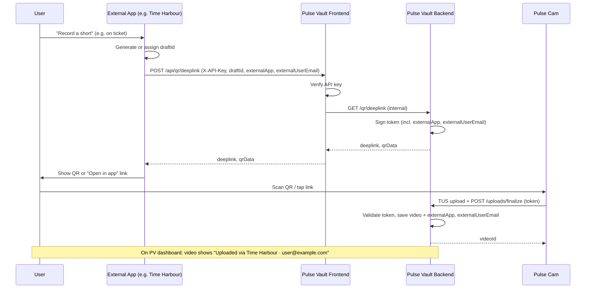

# External Apps (API Key)

Pulse Vault supports **external applications** (e.g. Time Harbour, ticketing systems) that need to generate “record a short” QR codes or deep links **without** sharing user login. Those apps use an **API key** and call the Pulse Vault frontend API to get a deeplink; the token carries app and user context so the dashboard can show “Uploaded via X”.

## Overview

```
┌──────────────────┐     API key      ┌─────────────────────┐     internal     ┌─────────────────────┐
│  External App    │ ─────────────────▶│  Pulse Vault        │ ───────────────▶│  Pulse Vault        │
│  (e.g. Time      │  POST /api/qr/    │  Frontend           │  GET /qr/        │  Backend             │
│   Harbour)       │  deeplink         │  (Next.js)          │  deeplink       │  (Fastify)           │
└──────────────────┘                   └─────────────────────┘                 └─────────────────────┘
        │                                        │                                        │
        │  Returns deeplink + qrData            │  Verifies API key,                     │  Signs token with
        │  (show QR / "Open in app")             │  proxies to backend                    │  externalApp, externalUserEmail
        ▼                                        ▼                                        ▼
┌──────────────────┐                   ┌─────────────────────┐                 ┌─────────────────────┐
│  User scans QR   │ ──── TUS ────────▶│  Pulse Vault        │                 │  Token → storage     │
│  Pulse Cam       │  upload + finalize │  Backend             │                 │  "Uploaded via X"    │
└──────────────────┘                   └─────────────────────┘                 └─────────────────────┘
```

- **No shared login** — The external app does not use Pulse Vault sessions; it authenticates with an API key.
- **One draft per context** — The external app generates or assigns a `draftId` (e.g. per ticket/session) and sends it when requesting the deeplink.
- **Attribution** — The app can send `externalApp` (e.g. `"timeharbour"`) and `externalUserEmail` (or `externalUserId`). These are embedded in the signed token and stored with the video so the Pulse Vault dashboard can show “Uploaded via Time Harbour · user@example.com”.

## End-to-end flow (sequence)



## Token to dashboard attribution

```
  Request (external app)                    Signed token (backend)              Video metadata (after finalize)
  ─────────────────────                    ─────────────────────               ─────────────────────────────
  externalApp: "timeharbour"       ──▶     payload.externalApp            ──▶   video.externalApp
  externalUserEmail: "u@ex.com"    ──▶     payload.externalUserEmail      ──▶   video.externalUserEmail
  externalUserId: "th-123"         ──▶     payload.externalUserId        ──▶   video.externalUserId
                                                                                        │
                                                                                        ▼
                                                                              Dashboard card: "Uploaded via Time Harbour · u@ex.com"
```

## 1. Get an API key

A Pulse Vault **admin** creates the key:

1. Log in to Pulse Vault and open **Admin**.
2. In **API keys for external apps**, create a new key: app name (e.g. “Time Harbour”), optional URL and description.
3. Copy the key **once** (it is only shown at creation). Store it securely in the external app (e.g. env var `PULSEVAULT_API_KEY`).

## 2. Request a deeplink

The external app calls the **Pulse Vault frontend** (not the backend directly):

**Endpoint:** `POST /api/qr/deeplink` or `GET /api/qr/deeplink`

**Authentication:** API key in a header:

- `X-API-Key: pv_xxxx...`, or  
- `Authorization: Bearer pv_xxxx...`

**Request (POST, JSON body):**

| Field | Required | Description |
|-------|----------|-------------|
| `draftId` | No* | UUID for this recording session. Omit to let Pulse Vault generate one. *Recommended: external app sends one per ticket/session. |
| `userId` | No | Pulse Vault user id if the app has linked accounts. Default: `"anonymous"`. |
| `server` | No | Base URL for the deeplink (default: Pulse Vault frontend URL). |
| `externalApp` | No | App identifier for dashboard label, e.g. `"timeharbour"`. |
| `externalUserEmail` | No | Email (or identifier) of the user in the external app. |
| `externalUserId` | No | External app’s own user id. |
| `expiresIn` | No | Token lifetime in seconds (default: 86400). |
| `oneTimeUse` | No | If `true`, token is single-use. |

**Example (POST):**

```bash
curl -X POST "https://pulse-vault.example.com/api/qr/deeplink" \
  -H "Content-Type: application/json" \
  -H "X-API-Key: pv_xxxx" \
  -d '{
    "draftId": "550e8400-e29b-41d4-a716-446655440000",
    "externalApp": "timeharbour",
    "externalUserEmail": "user@timeharbour.example.com"
  }'
```

**Example (GET, query params):**

```
GET /api/qr/deeplink?draftId=550e8400-e29b-41d4-a716-446655440000&externalApp=timeharbour&externalUserEmail=user%40example.com
X-API-Key: pv_xxxx
```

**Response (200):**

```json
{
  "deeplink": "pulsecam://?mode=upload&server=...&token=...&draftId=...",
  "qrData": "pulsecam://?mode=upload&server=...&token=...&draftId=...",
  "server": "https://pulse-vault.example.com",
  "token": "eyJ...",
  "expiresAt": "2026-03-03T01:00:00.000Z",
  "expiresIn": 86400,
  "tokenId": "uuid",
  "draftId": "550e8400-e29b-41d4-a716-446655440000",
  "userId": "anonymous",
  "externalApp": "timeharbour",
  "externalUserEmail": "user@timeharbour.example.com",
  "externalUserId": null
}
```

Use **`deeplink`** or **`qrData`** to render a QR code or an “Open in Pulse app” link.

## 3. User flow

1. In the external app, the user triggers “Record a short” (or similar) for a ticket/session.
2. The app calls `POST /api/qr/deeplink` with a `draftId` (and optional `externalApp`, `externalUserEmail`).
3. The app shows the QR (or link) from the response.
4. The user scans the QR (or taps the link) → Pulse Cam opens with that token and draft.
5. The user records and uploads; Pulse Vault finalizes the upload and stores the video with metadata (including `externalApp`, `externalUserEmail` from the token).
6. On the **Pulse Vault dashboard**, the video appears with a line like “Uploaded via Time Harbour · user@example.com”.

## 4. Responsibility split

| Pulse Vault | External app |
|-------------|---------------|
| Issues API keys (admin UI). | Stores the API key securely (e.g. env). |
| Exposes `POST/GET /api/qr/deeplink` and validates the API key. | Chooses **where** to trigger the flow (e.g. per ticket). |
| Puts `externalApp` / `externalUserEmail` in the token and storage. | Generates or assigns **draftId** per ticket/session. |
| Shows “Uploaded via X” on the dashboard. | Calls the API and displays the QR or link. |
| — | Optionally links a Pulse Vault user and sends `userId`. |

The external app decides how and where to link the flow (which screens, which entities get a draftId, and how to store the association).

## 5. Errors

| Status | Meaning |
|--------|---------|
| `401` | Missing or invalid API key. |
| `500` | Server misconfiguration (e.g. `BACKEND_URL` or `BETTER_AUTH_URL` not set). |
| `502` | Backend unreachable when generating the deeplink. |

Response body is JSON, e.g. `{ "error": "Missing API key. Use X-API-Key or Authorization: Bearer <key>." }`.
